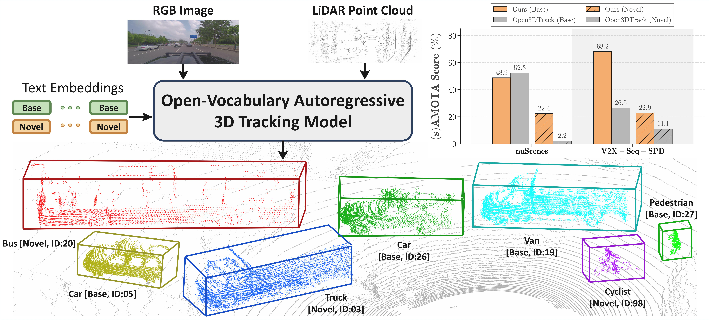

# NOVA: Next-step Open-Vocabulary Autoregression for 3D Multi-Object Tracking in Autonomous Driving 🌟

**NOVA** is a novel 3D tracking framework that redefines object perception through the **Autoregressive Paradigm**. By formulating tracking as a sequential prediction task within an **Open-Vocabulary** state space, NOVA achieves unprecedented generalization across unseen categories in complex 3D environments.

---

## 🖼️ Teaser

  

---

## 🎥 Demo

<video src="./assets/demo.mp4" controls="controls" width="100%" height="auto">
  Your browser does not support the video tag.
</video>

---

## 📅 Roadmap

- [x] **Technical Report/Paper**: Detailed methodology and experimental results. ([arXiv](https://arxiv.org/abs/2603.06254))
- [ ] **Inference Code**: Core implementation of the NOVA architecture.
- [ ] **Pre-trained Weights**: Model checkpoints trained on large-scale 3D datasets.
- [ ] **Evaluation Suite**: Scripts for benchmarking on standard 3D tracking datasets.

---

## 🚀 Coming Soon

We are currently cleaning up the codebase and preparing comprehensive documentation. The full source code, pre-trained models, and usage examples will be released shortly.

**Stay tuned by Starring the repository!** 🌟

---

## ✉️ Contact

For any inquiries or potential collaborations, please open an issue or contact:
`xifen527@163.com`

---

## 📄 License

This project is licensed under the [Apache 2.0 License](LICENSE).